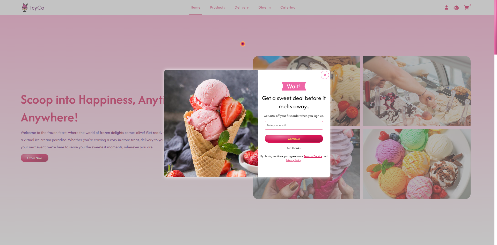
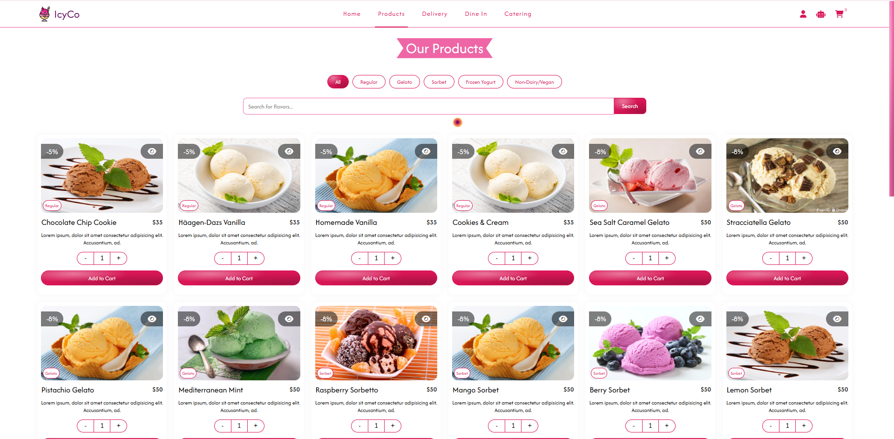
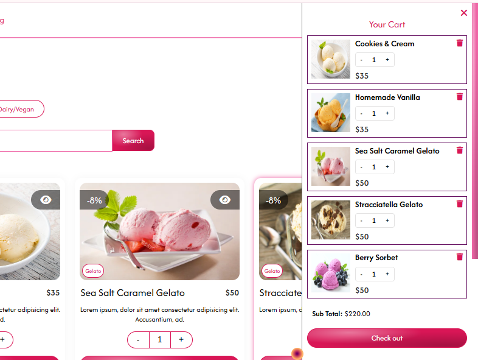
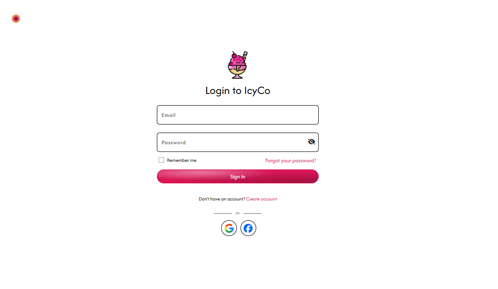
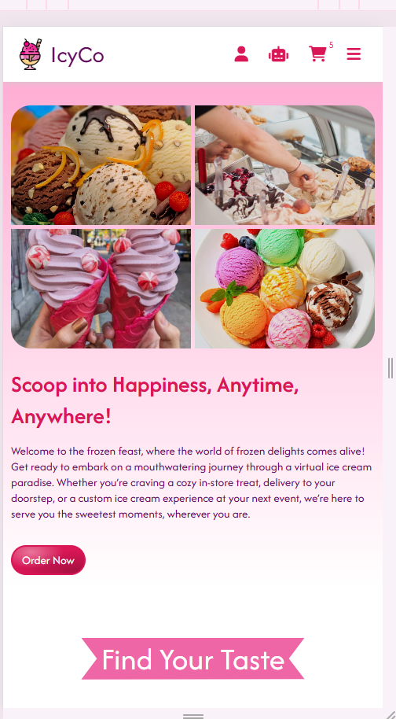

# 🍦 Ice Cream Parlour Website

A modern and responsive Ice Cream Parlour website built using HTML, CSS, and JavaScript.  
This project includes a complete frontend UI with product pages, shopping cart, authentication pages, blogs, FAQ section, and responsive design.

---

# 🚀 Live Demo

Add your deployment link here after hosting.

Example:

https://your-project-name.vercel.app

---

# ✨ Features

- 🍨 Modern Ice Cream Store UI
- 🛒 Shopping Cart Interface
- 🔐 Login & Signup Pages
- 📱 Fully Responsive Design
- 🎨 Smooth Animations & Hover Effects
- 🖼️ Gallery & Blog Pages
- ❓ FAQ & Contact Pages
- 📄 Privacy Policy & Terms Pages
- ⚡ Fast and Lightweight Frontend

---

# 🛠️ Technologies Used

- HTML5
- CSS3
- JavaScript
- Bootstrap
- Responsive Web Design

---

# 📸 Screenshots

## 🏠 Home Page



---

## 🍦 Products Page



---

## 🛒 Cart Page



---

## 🔐 Login Page



---

## 📱 Responsive Mobile View



---

# 📂 Project Structure

```bash
ice-cream-parlour-website/
│
├── css/
├── js/
├── images/
├── assets/
│   └── screenshots/
├── index.html
├── cart.html
├── login.html
├── product.html
└── README.md
```

---

# ⚙️ Installation

Clone the repository:

```bash
git clone https://github.com/atiqurrehman112/ice-cream-parlour-website
```

Open the project folder:

```bash
cd ice-cream-parlour-website
```

Run the project by opening:

```bash
index.html
```

---

# 🌐 Deployment

You can deploy this project on:

- Vercel
- Netlify
- GitHub Pages

---

# 👨‍💻 Author

## Atiq ur Rehman

Computer Science Student | Frontend Developer | UI/UX Enthusiast

- 🌐 Portfolio:
- 💼 GitHub: https://github.com/atiqurrehman112/ice-cream-parlour-website

---

# ⭐ Support

If you like this project, give it a star on GitHub ⭐
